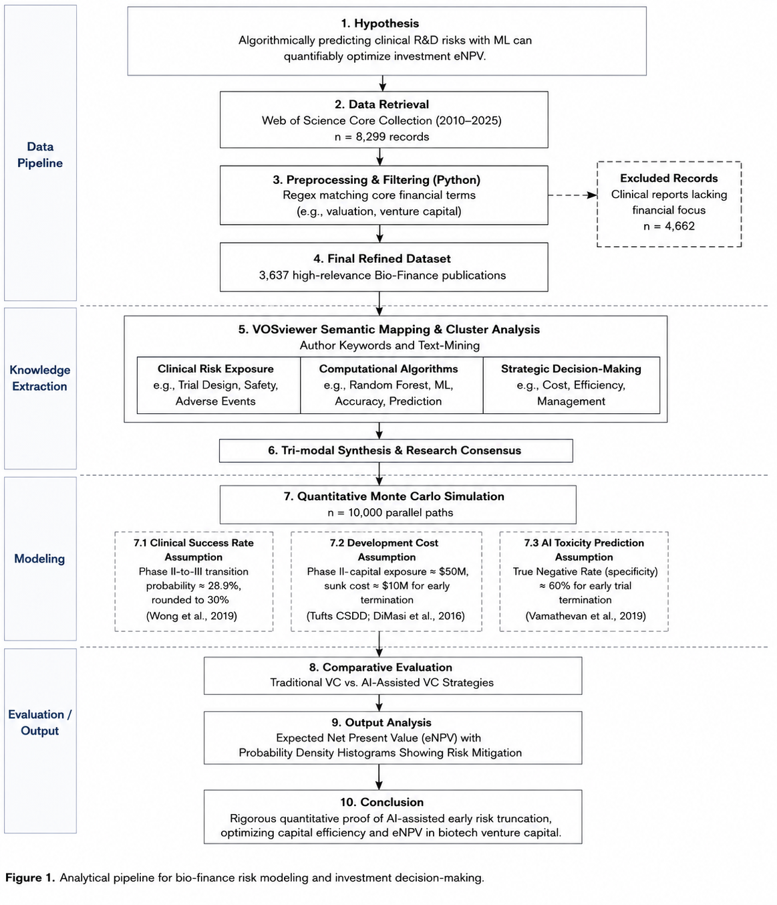

# The Quantitative Landscape of Bio-Finance (2010–2025)

**A Dual-Pipeline Framework Evaluated via Bibliometric NLP and Monte Carlo Risk Simulation**

This repository contains the data pipeline and quantitative financial modeling tools developed to assess risk in pharmaceutical R&D. By bridging natural language processing (NLP) of academic literature with Monte Carlo simulations, this project quantifies how artificial intelligence can mitigate the financial "Valley of Death" in mid-stage clinical trials.

## 1. Executive Summary & Key Metrics

Using historical clinical transition rates and industry capital expenditure data, the Monte Carlo simulation (n=10,000 parallel trials) evaluates the Expected Net Present Value (eNPV) of traditional venture capital versus AI-assisted early termination strategies.

* **Traditional VC Model:** Facing historical attrition rates, the average eNPV per Phase II program is **$102.65 Million**.
* **AI-Assisted VC Model:** Deploying an algorithmic stop-loss mechanism with a conservative 60% specificity (True Negative Rate) increases the average eNPV to **$119.33 Million**.
* **Financial Alpha:** AI-driven early termination of destined clinical failures yields an expected value addition of **+$16.68 Million** per program.

*(See `MonteCarlo_eNPV_Distribution.jpg` for the full probability density visualization).*

## 2. Repository Structure

* `BioFinance_WOS_Data/`: Contains the raw text data of 8,000+ publications retrieved from the Web of Science Core Collection.
* `data_pipeline.py`: The NLP and text-mining script. It filters the raw data using core financial regex patterns, extracts geographical/temporal trends, and structures the data for VOSviewer semantic mapping.
* `monte_carlo.py`: The financial simulation engine. It applies empirical parameters to model comparative eNPV distributions.
* **Visualizations:**
  * `Data_Publication_Trends.jpg`: Output from the data pipeline showing growth metrics.
  * `VOSviewer_Keyword_Network.jpg` & `VOSviewer_Cluster_Analysis.jpg`: Semantic clustering generated from the filtered dataset.

## 3. Usage

The code is written in standard Python and utilizes relative paths. To reproduce the study:

1. Clone or download this repository.
2. Run `data_pipeline.py` to process the raw Web of Science data and generate the trend plots.
3. Run `monte_carlo.py` to execute the 10,000-trial simulation and output the risk distribution metrics. 
*(Note: Random seed is locked at `42` for absolute mathematical reproducibility).*

## 4. Empirical Parameters & Academic Backing

To ensure rigorous financial modeling, all simulation inputs are strictly derived from highly-cited literature:
* **Phase II-to-III Transition Rate (30%):** Rounded from the 28.9% historical transition probability analyzed across 400,000+ entries by Wong et al. (*Biostatistics*, 2019).
* **Capital Exposure ($50M):** Standardized mid-stage R&D expenditure approximation based on the Tufts Center for the Study of Drug Development (DiMasi et al., *Journal of Health Economics*, 2016).
* **AI Specificity (60%):** A conservative baseline true negative rate mapped from the standard ROC-AUC range (0.7-0.8) of machine-learning-based toxicity prediction models (Vamathevan et al., *Nature Reviews Drug Discovery*, 2019).

---
*Developed by Zach Zhai.*
